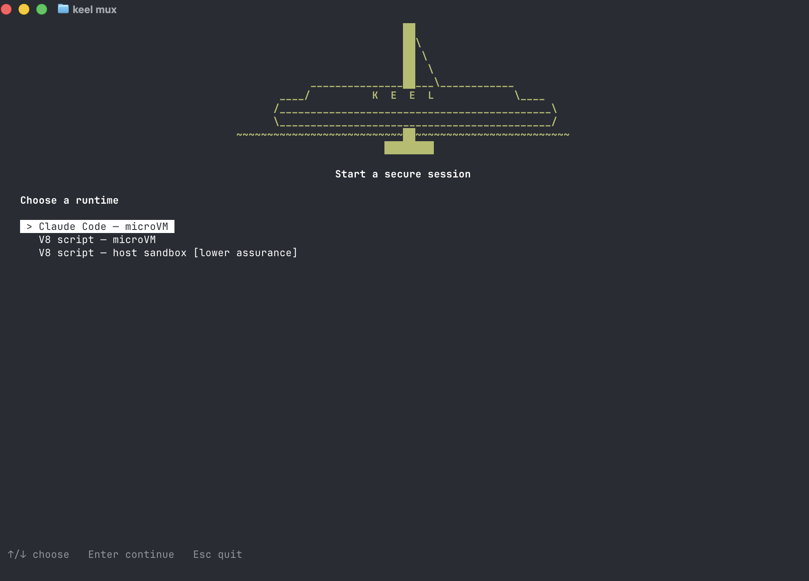

# Keel

Keel is a research prototype for running AI coding and research workloads inside a local security boundary. It treats the model, its harness, repository content, tool output, and network content as potentially hostile, then places sensitive actions behind a small trusted kernel.

Keel currently targets Apple silicon macOS. It is suitable for research, evaluation, and local experimentation; it is not yet a production security product.

  

## Why Keel exists

An agent can read an untrusted file or web page and then act with the authority of the person who launched it. Conventional sandboxing helps, but it does not answer questions such as:

- May this particular process send data to this destination?
- Did the proposed write depend on untrusted input?
- Is an approval prompt genuine, or was it drawn by the agent?
- Can the workload use a credential without receiving the credential itself?
- Can an operator later verify what the security boundary allowed?

Keel makes those decisions outside the workload.

## How it works

~~~text
operator
   |
   v
trusted input and approval UI
   |
   v
Keel kernel ── policy + provenance + budgets + audit
   |
   +── VZ microVM ── Claude Code or Node/V8 workload
   |
   +── host V8 sandbox ── pinned Deno process (lower assurance)
   |
   +── brokered relays ── network, Git, MCP, and credential use
~~~

The workload proposes actions. Keel reconstructs and validates those actions, rejects structurally unsafe requests, evaluates policy and provenance constraints, asks for trusted operator approval when required, lets narrow relays perform permitted actions, and records authenticated audit events. The relays transport effects but do not grant their own authority.

## Isolation profiles

| Profile | Intended use | Boundary |
| --- | --- | --- |
| Claude Code - microVM | Interactive agent sessions | macOS Virtualization.framework VM with no ordinary guest NIC |
| V8 script - microVM | JavaScript automation with the stronger boundary | Node/V8 inside the microVM |
| V8 script - host sandbox | Fast local JavaScript experiments | Pinned Deno process with restricted capabilities; lower assurance and requires an explicit grant |

The two V8 profiles use the same trusted action broker, policy, provenance, budgets, and audit pipeline. They differ in where the JavaScript engine runs and therefore in the strength of the isolation boundary.

## What the guest provides

The Claude microVM guest is an Alpine Linux image with:

- **Claude Code**, with Keel's own MCP tools for pull requests and issue
  reads;
- **a headless Chromium** driven by `agent-browser`, which the agent uses
  through MCP and you can drive yourself from a guest shell. Screenshots,
  downloads, and HAR files land in `.keel-browser/` in the workspace. See
  [the guest browser](docs/USAGE.md#the-guest-browser).
- **build toolchains:** gcc, make, npm, pip, Rust, and Go, with registries
  reached through Keel's proxy. See
  [building software in the guest](docs/USAGE.md#building-software-in-the-guest).

A **triage profile** (`--profile triage --scope RULE`) confines a run to the
hosts an analyst declares and refuses everything else without a prompt. See
[reproducing a report](docs/USAGE.md#10-reproduce-a-report-triage-profile).

## Quick start

### Requirements

- Apple silicon Mac
- Xcode Command Line Tools: `xcode-select --install`. If a newer beta macOS
  SDK is installed beside older tools, see
  [linking fails](docs/USAGE.md#13-common-errors).
- Docker Desktop, running during setup. It builds the guest image; it is not
  the isolation boundary.
- Rust through [rustup](https://rustup.rs); the first `cargo` command in the
  checkout installs the toolchain pinned in `rust-toolchain.toml`
- cpio, curl, git, gzip, Python 3, shasum, and tar (present on macOS with the
  Command Line Tools)
- for Bedrock, the AWS CLI v2
- about 7 GB of free disk for downloads, build caches, and the installed
  runtime, plus about 2 GB for Docker's build images

### Build and install local runtime artifacts

~~~sh
git clone https://github.com/sand339/keel.git && cd keel
cargo run -p keel-cli --bin keel -- setup     # about 7 minutes on a first run
export PATH="$HOME/.local/bin:$PATH"          # if ~/.local/bin is not on PATH yet
keel doctor
~~~

The setup command builds the runtime, installs the launcher at ~/.local/bin/keel,
and prepares the pinned guest, V8, and xterm-headless renderer artifacts used by
the current checkout. Downloads are version- and SHA-256-pinned; the guest's
Alpine packages are not, so the guest image is not yet reproducible. See
[pinned artifacts](docs/ARTIFACTS.md).

### Configure model access

For Anthropic API access:

~~~sh
export ANTHROPIC_API_KEY='...'
~~~

For Amazon Bedrock with AWS SSO:

~~~sh
aws sso login --profile PROFILE
export KEEL_MODEL_PROVIDER=bedrock
export AWS_REGION=us-west-2
export KEEL_AWS_CREDENTIAL_PROCESS='aws configure export-credentials --profile PROFILE --format process'
~~~

For OpenRouter (any model, priced from a snapshot you admit at launch):

~~~sh
export OPENROUTER_API_KEY='sk-or-...'
keel mux --auth openrouter --model anthropic/claude-sonnet-4.6
~~~

Signing in to Claude Code on the host does not currently transfer that SSO session into Keel. Use an Anthropic API key, OpenRouter, or the Bedrock configuration above.

### Start a session

~~~sh
keel mux
~~~

The launcher asks for a runtime and workspace. V8 workloads also require a JavaScript entry file relative to the selected workspace.

Per-run model ceilings default to 1,000,000 tokens and USD 20.00. Override
them with `--model-token-budget TOKENS` and `--model-cost-budget USD`; elevated
ceilings require confirmation on the trusted task-admission screen.

Direct V8 examples:

~~~sh
# Recommended: V8 inside the microVM
keel run --isolation vm-v8 v8 docs/examples/v8-smoke.mjs

# Lower-assurance host sandbox; the explicit grant is intentional
keel run --isolation v8-sandboxed \
  --allow isolation:v8-sandboxed \
  v8 docs/examples/v8-smoke.mjs
~~~

The trusted terminal requires a second, exact `HOST V8` confirmation before the
lower-assurance process starts.

## Security posture

Keel is designed to do the following. Each property links to the tests that
exercise it.

| Property | Evidence |
| --- | --- |
| Model and service credentials stay out of the workload; the guest presents sentinels, swapped only on their exact host and path | [`credential_scope.rs`](crates/trusted/keel-secrets/tests/support/credential_scope.rs), [`openrouter.rs`](crates/trusted/keel-secrets/tests/openrouter.rs) |
| No ordinary guest networking; allowed requests go through brokered host relays, authorized per request after TLS termination | VZ host preflight and guest network report in [`keel-vz-spike.rs`](crates/untrusted/keel-isolate/src/bin/keel-vz-spike.rs); [`provenance_gate.rs`](crates/trusted/keel-kernel/tests/provenance_gate.rs) |
| The guest workload is confined a second time inside the VM: no capabilities, Landlock, seccomp, and a bounded cgroup | `confinement_preflight_requires_every_layer` in [`keel-mcp`](crates/untrusted/keel-mcp/src/lib.rs); the host refuses to boot a guest whose preflight fails |
| Each guest request carries the process that made it, and pushes and pull requests from workspace code are gated | `a_pull_request_carries_the_guest_origin_of_its_mcp_connection` in [`keel-mcp`](crates/untrusted/keel-mcp/src/lib.rs); [`push_provenance.rs`](crates/trusted/keel-kernel/tests/push_provenance.rs) |
| Explicit policy combines with data provenance, budgets, and operator approval | [`primary_scenario.rs`](crates/trusted/keel-policy/tests/primary_scenario.rs), [`stateful_rules.rs`](crates/trusted/keel-policy/tests/stateful_rules.rs), [`write_inheritance.rs`](crates/trusted/keel-provenance/tests/write_inheritance.rs), [`model_budget.rs`](crates/trusted/keel-kernel/tests/model_budget.rs) |
| Approval input is isolated from the untrusted terminal renderer | [`secure_attention.rs`](crates/trusted/keel-input/tests/secure_attention.rs), [`terminal_control.rs`](crates/trusted/keel-input/tests/terminal_control.rs) |
| `A` binds to one exact action and is consumed once; `G` covers only the displayed host, port, and method, expires after 15 minutes, 64 actions, or a floor drop, and excludes credential-bearing and high-impact effects | [`egress_grant_scope.rs`](crates/trusted/keel-kernel/tests/egress_grant_scope.rs) and the permit tests in the kernel's [unit suite](crates/trusted/keel-kernel/tests/support/unit.rs) |
| A triage run's declared scope is enforced, refusing everything else without a prompt | [`scope.rs`](crates/trusted/keel-provenance/tests/scope.rs), [`triage_scope.rs`](crates/trusted/keel-input/tests/triage_scope.rs) |
| Every run records a canonical admission manifest before its workload starts | [`admission_manifest.rs`](crates/trusted/keel-input/tests/admission_manifest.rs) |
| Audit records are authenticated and hash-chained, and an unsealed prefix is never accepted as complete | [`verification_status.rs`](crates/trusted/keel-audit/tests/verification_status.rs) |
| The hand-written trusted Rust stays under a checked size ceiling | invariant I1 in [`ci/check_invariants.py`](ci/check_invariants.py) |

Keel does not claim to:

- determine whether every semantically harmful action is harmful;
- prevent an operator from approving a dangerous but accurately displayed action;
- stop exfiltration through output that policy legitimately permits;
- make the host V8 sandbox equivalent to a microVM;
- protect against a compromised host OS, hypervisor, hardware, trusted dependency, or admitted runtime artifact;
- provide production-grade availability, remote attestation, or complete crash recovery.

Read the [threat model](docs/THREAT-MODEL.md) before relying on the prototype for sensitive work.

## Known limitations

- **Shadow verdicts.** The action-centric verdicts (task intent, payload flow,
  push integrity, per-turn context) are recorded and reported, but most do not
  decide yet. `keel report --axes` and `--context` measure them.
- **Push diff.** The protected-file diff a push is judged by is computed by
  the untrusted Git relay, not derived by trusted code from the pack.
- **Proxy protocols.** The trusted proxy speaks HTTP/1.1 only and does not
  relay WebSockets, so pages and tools that need them do not work fully.
- **Guest image.** Alpine packages, including Chromium, are not pinned, so the
  image is not reproducible, and Chromium is patched only when setup rebuilds
  the image. Chromium runs without its own sandbox; the VM is the boundary.
- **Browser view.** There is no live view of the guest browser; use the
  `agent-browser` CLI and the screenshots it saves.
- **Platform.** Apple silicon macOS only. Linux is design work.
- **Teardown.** There is no verified teardown receipt or crash-recovery
  cleanup yet. On some abnormal exits, such as the controlling terminal
  closing, the runtime backend and its VM can keep running until stopped by
  hand.

## Documentation

| Document | Purpose |
| --- | --- |
| [Usage](docs/USAGE.md) | Installation, credentials, sessions, approvals, audit, and troubleshooting |
| [Architecture](docs/ARCHITECTURE.md) | Components, trust boundaries, action flow, and code map |
| [Threat model](docs/THREAT-MODEL.md) | Assets, adversaries, intended guarantees, assumptions, and residual risks |
| [Roadmap](docs/ROADMAP.md) | Future work only, with links to detailed design notes |
| [Pinned artifacts](docs/ARTIFACTS.md) | Every downloaded artifact, its source and pin, and how to update it |
| [Release checklist](docs/RELEASE.md) | What a release must pass, and the notes for each release |
| [Documentation index](docs/README.md) | Design notes, examples, and historical project material |
| [Security policy](SECURITY.md) | Private vulnerability reporting, scope, and response process |
| [Contributing](CONTRIBUTING.md) | Development workflow and trust-boundary rules |

## Project status

The repository contains working microVM and V8 execution paths, policy enforcement, a conservative session-wide provenance floor, trusted approvals, credential-aware relays, process attribution, an audited admission manifest, session management, and authenticated audit logs. The action-centric verdicts and the per-turn context digest log run in shadow mode while their data is measured. Remaining work includes enforcement of those verdicts, reproducible packaging, evaluation, verified teardown, and portability beyond macOS.

Security-sensitive behavior should be judged from the current source, tests, and threat model—not from roadmap items or design proposals.

## License

Keel is licensed under the [Apache License 2.0](LICENSE). Embedded dependency
attributions are listed in [Third-party notices](THIRD_PARTY_NOTICES.md).
