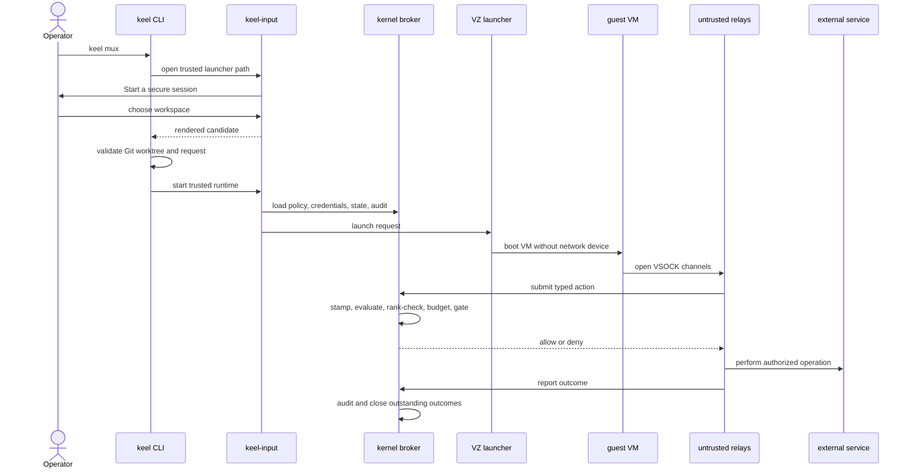
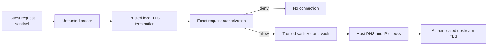

# Learning Keel

This guide explains Keel as both a security design and a Rust implementation.
It is for readers who want to use the project, understand its internals, and
change it without weakening its security boundary.

Keel is a research prototype for running an untrusted coding agent in a local
virtual machine while keeping authority on the trusted host. The agent can edit
a selected Git workspace and use explicitly mediated services. It receives no
general network device and no real credentials. A small host-side kernel decides
whether consequential actions may proceed.

The central assumption is deliberately severe:

> The agent, its harness, its output, the guest operating system, and every
> untrusted relay may be compromised.

Keel does not depend on the model recognizing malicious instructions. It limits
what a compromised agent can do.

## 1. How to use this guide

The shortest learning path is:

1. Read the mental model and trust boundary.
2. Follow one session from startup to shutdown.
3. Study the mediated action and decision pipeline.
4. Read policy, provenance, gates, secrets, egress, and auditing.
5. Use the repository map to enter the code.
6. Use the feature checklist before making security-sensitive changes.

Implementation status matters:

- **Implemented** means the current repository contains the enforcement path and
  tests.
- **Experimental** means the path works but remains prototype quality or has a
  narrow supported surface.
- **Planned** means the design is documented but is not a current guarantee.

The companion documents are:

- [PLAN.md](PLAN.md): invariants, threat scenarios, phases, and decisions;
- [ARCHITECTURE.md](ARCHITECTURE.md): the compact architecture argument;
- [USAGE.md](USAGE.md): current commands and setup;
- [ROADMAP.md](ROADMAP.md): completed and remaining phases.

## 2. The core mental model

Most sandboxes focus on where a process runs. Keel also focuses on where
authority lives.

The guest contains Linux, the coding harness, and the project workspace. The
trusted host has authority to:

- decide whether an action is allowed;
- classify information delivered to the agent;
- remember session facts and provenance;
- hold and apply credentials;
- request trusted operator approval;
- enforce budgets;
- write the authenticated audit chain.

The guest may ask. It cannot grant its own request.

Four separations explain most of the architecture:

| Separation | Meaning |
|---|---|
| Execution from authority | Keel may launch the harness without trusting it. |
| Intent from enforcement | Natural language proposes structured intent; deterministic code enforces it. |
| Credentials from requests | The guest uses a sentinel; the host authenticates only after authorization. |
| Display from input | Untrusted code renders; trusted code owns keyboard input and approval. |

When reviewing a feature, ask which side of each separation it belongs on.

## 3. Threat model and security claim

### What may be hostile

Keel treats these components as untrusted:

- the model and all context it has read;
- the agent harness and its terminal UI;
- the guest after launch;
- repository files, issue text, web pages, dependency metadata, and API bodies;
- host-side protocol adapters, renderers, Git relays, MCP relays, and VM
  launchers.

An untrusted component may lie about an action, forge metadata, omit a report,
emit adversarial terminal sequences, or attempt to obtain credentials.

### What Keel trusts

Keel trusts:

- the local operator and physical terminal input;
- the six trusted Rust crates;
- the host operating system and Apple Virtualization.framework;
- admitted binaries and dependencies;
- the configured guest image at admission and launch.

Dependencies remain part of the review surface even when first-party trusted
code stays small.

### What Keel aims to guarantee

1. The guest has no ordinary network route, DNS path, or usable credential.
2. Consequential operations cross a typed kernel decision point.
3. Policy cannot override structural denials.
4. Approvals originate on a keyboard path the guest does not control.
5. `A` is bound to one action and target; reusable authority requires an
   explicit, bounded `G` decision when the trusted screen offers it.
6. Information provenance can reduce later authority and cannot silently rise.
7. Audit records form an authenticated, tamper-evident sequence.

Keel does not claim the agent will behave safely, that a VM defeats a host-kernel
exploit, or that every action is semantically understood. Local edits inside the
selected workspace are intentional; important external and high-impact
operations are mediated.

## 4. Trust boundary and TCB

The **trusted computing base**, or TCB, is the code whose correctness is required
for Keel's security claim.

```text
Trusted host
├── keel-kernel       decision pipeline, state, gates, budgets
├── keel-policy       Cedar evaluation
├── keel-provenance   source classes and trust floor
├── keel-secrets      credentials, signing, TLS, sanitizing
├── keel-audit        authenticated audit chain
└── keel-input        real terminal input and trusted runtime broker

Untrusted host
├── keel-cli          commands and orchestration
├── keel-compile      natural-language policy translation
├── keel-conn         protocol classification
├── keel-gitd         Git protocol relay
├── keel-isolate      VM launcher
├── keel-mcp          MCP and GitHub adapters
└── keel-render       terminal compositor

Untrusted guest
└── Linux + Claude Code + workspace + sentinel credentials
```

Trusted crates live under
[`crates/trusted`](../crates/trusted). Adapters live under
[`crates/untrusted`](../crates/untrusted).

### Why this split exists

An untrusted relay can parse a complicated protocol safely if it cannot decide
or hold a credential. If it parses incorrectly, the kernel receives an invalid
or overly broad request and denies it. Moving protocol and UI code out of the TCB
makes the security review finite.

Nothing outside the TCB may make an authorization decision. The kernel never
asks a model to decide policy or approve an action.

### TCB budget

Keel has a 16,000-line hard ceiling for first-party trusted Rust. Current crate
allocations are 15,331 lines, with 669 held as unallocated reserve:

| Crate | Budget |
|---|---:|
| `keel-kernel` | 5,266 |
| `keel-policy` | 852 |
| `keel-provenance` | 1,321 |
| `keel-audit` | 1,228 |
| `keel-secrets` | 3,338 |
| `keel-input` | 3,326 |
| **Allocated crate budgets** | **15,331** |
| **Unallocated reserve** | **669** |
| **Hard ceiling** | **16,000** |

The cap is a design constraint, not proof of correctness. It forces trusted
growth to justify its review cost. [PLAN.md](PLAN.md) records the budget history
and reallocation rules.

CI also checks:

- every trusted crate declares `#![forbid(unsafe_code)]`;
- trusted crates do not depend on untrusted crates;
- dependency use follows the trusted dependency policy;
- only the kernel can construct the authority-bearing half of an action.

## 5. One session from command to shutdown



### 5.1 Workspace launcher

`keel mux` starts **Start a secure session** before resolving credentials,
creating the broker, or booting a VM. The first screen chooses Claude in a
microVM, a V8 script in a microVM, or the explicitly lower-assurance host V8
profile. The next screen offers a managed new workspace for Claude or an
existing Git worktree. V8 selections add a bounded relative entry-file prompt.

`keel-input` owns the real terminal. `keel-render` draws the picker through pipes
and returns a candidate. `keel-cli` resolves and validates the worktree,
canonicalizes the V8 entry file inside it, reconstructs the harness/isolation
pair, and leaves the host profile subject to its independent policy grant.

**Why:** a display parser and directory browser are large and exposed to
untrusted data. They do not need keyboard authority. A launcher selection is
therefore convenience rather than authority: it cannot manufacture the
`isolation:v8-sandboxed` grant.

Implementation:

- selection and validation:
  [`keel-cli/src/lib.rs`](../crates/untrusted/keel-cli/src/lib.rs);
- trusted launcher relay:
  [`keel-input-runtime/session.rs`](../crates/trusted/keel-input/src/bin/keel-input-runtime/session.rs);
- visual launcher:
  [`keel-render/src/lib.rs`](../crates/untrusted/keel-render/src/lib.rs).

### 5.2 Run request and trusted intent

The CLI parses flags into `RunRequest`: session ID, isolation and provenance
modes, CPU count, connection reuse, persistence, capabilities, policy artifact,
workspace, harness, model, and authentication selection.

The trusted runtime loads only the fields it needs into `RuntimeIntent`, validates
the closed capability vocabulary, and reconstructs trusted state. A JSON request
written by untrusted orchestration is not itself authority.

**Why:** CLI syntax can evolve without making the entire CLI part of the TCB.

### 5.3 Broker construction

Before VM launch, the trusted runtime creates:

- a hash-verified Cedar policy;
- session facts and provenance state;
- a target-bound credential vault;
- an operator approval authority;
- budget and rate state;
- an audit writer and run key;
- a private Unix-domain kernel action socket;
- the host set implied by model, Git, PR, and egress intent.

Missing policy, credential scope, channel declarations, or required enforcement
boundaries stop startup.

### 5.4 VM launch

`keel-runtime` validates the CPU count and constructs a `RuntimePlan` from the
configured kernel, initramfs, workspace, and VZ backend. It writes a temporary,
restricted control directory containing:

- the public per-run CA certificate;
- initial terminal dimensions;
- a launch script with non-secret settings and sentinels.

It invokes the native VZ backend. The guest receives the selected workspace and
control directory, never a host credential.

Implementation:

- isolation plan:
  [`keel-isolate/src/lib.rs`](../crates/untrusted/keel-isolate/src/lib.rs);
- runtime:
  [`keel-runtime.rs`](../crates/untrusted/keel-isolate/src/bin/keel-runtime.rs);
- macOS VZ backend:
  [`keel-vz-spike.rs`](../crates/untrusted/keel-isolate/src/bin/keel-vz-spike.rs).

### 5.5 Guest boot and preflight

The VM boots a pinned Linux kernel and a small stage-1 initramfs, which mounts
the read-only root disk under a writable overlay and hands over (D61). Guest
init:

1. verifies no default route, DNS, metadata access, or private-network path;
2. mounts the workspace and control files;
3. starts proxy endpoints and the terminal PTY;
4. launches the harness;
5. opens VSOCK connections to the host.

The host also reports that the VZ configuration contains no network device.
A guest preflight failure is fatal.

**Why:** removing the device is stronger than relying on one guest allowlist.

### 5.6 Shutdown

At shutdown the kernel:

- records final enforcement state;
- marks authorized external outcomes with no report as `unreported`;
- persists provenance floor and history as non-authoritative status evidence;
- flushes the audit chain;
- removes temporary sockets and control files.

## 6. Isolation, workspace, and channels

### Virtual machine boundary

Keel uses Apple Virtualization.framework on Apple silicon. The VZ backend is a
driver outside the trusted decision kernel. It supports 1 through 64 requested
vCPUs, defaults to 2, and lets Virtualization.framework validate the request for
the current Mac.

**Why a VM:** the boundary sits below the harness and language runtime. A
container shares the host kernel and supports a different isolation claim.

**Why drive a backend:** implementing a VMM would overwhelm the small-TCB thesis.

### V8 profiles

Keel treats V8 as a harness, not as another authorization system.

`vm-v8` runs Node inside the same microVM. Node's permission model limits files
and process creation, while the VM remains the security boundary. This is the
default recommendation because the threat model already assumes an interpreter
escape.

`v8-sandboxed` runs pinned Deno directly on the host. It starts faster, clears
the inherited environment, limits file access to the workspace, refuses
run-time module downloads, and permits network access only to a fresh loopback
proxy. That proxy submits the destination to the normal trusted broker. Deno
and V8 are a semi-trusted core in this profile: an engine escape may become host
code execution.

The lower-assurance profile requires `isolation:v8-sandboxed`. The CLI checks
the grant for immediate feedback, and `keel-input` parses the raw request and
checks it again because only the trusted check is security-relevant. A VM
failure never selects the host profile.

The terminal launcher exposes both V8 profiles without changing that rule. It
asks for an existing worktree and a relative `.js`, `.mjs`, or `.cjs` entry
file. The CLI canonicalizes the candidate and refuses missing files, symlink
escapes, absolute paths, and unsupported extensions. A selected V8 tab is
labeled `V8/VM` or `V8/host`; the label reports the boundary but does not
participate in enforcement.

Both engines receive a small `Keel` global with `fetch` and `modelHeaders`.
The SDK can construct a request, but it cannot grant one. Policy, provenance,
approval, DNS, TLS, credential injection, and audit still happen in trusted
Rust after the proxy submits the destination.

Implementation:

- request and CLI:
  [`keel-cli/src/lib.rs`](../crates/untrusted/keel-cli/src/lib.rs);
- trusted admission:
  [`keel-input/src/lib.rs`](../crates/trusted/keel-input/src/lib.rs);
- backend dispatch and host Deno permissions:
  [`keel-runtime.rs`](../crates/untrusted/keel-isolate/src/bin/keel-runtime.rs);
- host loopback proxy:
  [`host_v8.rs`](../crates/untrusted/keel-isolate/src/host_v8.rs);
- guest launch:
  [`keel-launch.sh`](../spikes/keel-launch.sh);
- full design:
  [V8 isolation modes](design/v8-isolation.md).

### Workspace

The selected Git worktree is shared into the guest as `/workspace`. The agent can
read and modify it. Policy canonicalizes paths and checks containment so a
symlink cannot disguise an outside write.

### VSOCK channels

The current macOS backend separates:

| Port | Purpose |
|---:|---|
| 5000 | MCP |
| 5001 | mediated egress |
| 5002 | mediated Git |
| 5003 | terminal PTY |

Every action channel has a declared gate class. An undeclared channel causes
startup failure.

**Why:** verified transport identity becomes part of action context; guest labels
alone cannot establish a principal or action class.

## 7. The mediated action

Tool calls, egress, Git pushes, publication, and other important operations use
one action model:

```rust
pub struct Asserted {
    pub class: ActionClass,
    pub target: Target,
    pub declared_cost: Option<u64>,
}

pub struct Stamped {
    // Private, kernel-written fields
    principal: PrincipalId,
    trust: TrustFloor,
    facts: SessionFacts,
    attestation: AttestationRef,
    budget: BudgetView,
}
```

`Asserted` is guest-supplied and forgeable. `Stamped` is kernel-written and has
no public constructor. The guest can change every asserted byte without changing
the trusted principal, floor, facts, attestation, or budget view.

**Why one object:** separate Git, HTTP, and MCP allowlists tend to disagree. One
object lets the same identity, provenance, policy, budget, gate, and audit logic
govern every channel.

Implementation:
[`keel-kernel/src/lib.rs`](../crates/trusted/keel-kernel/src/lib.rs).

## 8. The decision pipeline

`Kernel::process` follows a fixed fail-closed order:

```text
receive
  → verify principal and channel
  → reject structural violations
  → stamp provenance, facts, attestation, and budget
  → evaluate Cedar policy
  → enforce minimum provenance rank
  → reserve budget
  → request a bound approval when required
  → inject or compute credentials
  → execute or authorize the relay
  → commit state and audit
```

The order is a security property:

- structural checks precede policy, so policy cannot permit protected-state
  modification;
- authorization precedes credential use;
- budget reservation precedes execution;
- a durable `attempted` record is written before external execution;
- state updates make prior contacts, writes, and denials visible to later rules.

The kernel returns:

- **allow** when all deterministic requirements pass;
- **deny** for non-overridable failure or operator denial;
- **escalate** when the operator may approve this exact exception.

Escalation never creates a general trusted mode.

## 9. Structural denials

These rules intentionally sit outside Cedar:

- the guest cannot modify policy, audit, attestation, provenance, or budget
  state;
- loopback, private, link-local, and metadata network addresses are rejected
  before policy;
- invalid credential targets are refused rather than offered for approval.

**Why:** operator policy may narrow normal behavior. It must not widen the
boundary that gives policy meaning.

The checks use `ProtectedState` and explicit kernel or credential-sanitizer
logic. Tests live with
[`keel-kernel`](../crates/trusted/keel-kernel) and
[`keel-secrets`](../crates/trusted/keel-secrets).

## 10. Deterministic Cedar policy

**Status: Implemented.**

Keel loads a Cedar schema and bundle from
[`keel-policy/policy/default`](../crates/trusted/keel-policy/policy/default).
The expected bundle hash is pinned. Modified bytes with the old hash fail.

The bundle begins with a permit and adds named `forbid` rules. Cedar's
forbid-overrides semantics produce a violations-set model: an action is allowed
only when no forbid applies.

Current rules cover:

- bulk writes to pre-existing files;
- writes after contacting a package registry;
- escalation after three behavioral denials of the same canonical action scope
  within 15 minutes;
- push without structured intent;
- push after contact with a non-owned source host;
- force push when accepted intent says `deny:force-push`.

Cedar receives raw session facts and the raw force-push target fact. Rust does not
reduce the interesting decision to a single precomputed “safe” boolean.

**Why Cedar:** deterministic semantics, Rust support, forbid-overrides behavior,
and later analysis tools make it suitable for runtime enforcement.

**Why hashed artifacts:** the reviewed policy must be the executed policy. Keel
does not hot-load changes into an active session.

Implementation:

- [schema](../crates/trusted/keel-policy/policy/default/schema.cedarschema);
- [rules](../crates/trusted/keel-policy/policy/default/policies.cedar);
- [loader and evaluator](../crates/trusted/keel-policy/src/lib.rs).

## 11. Session facts and stateful rules

The kernel remembers:

- files created and written by this vertex;
- hosts and registries contacted;
- writes and distinct files written in the last minute;
- cumulative denial and escalation counts, plus a typed trailing denial window
  keyed by opaque canonical action scope;
- provenance floor, history, and sources read;
- structured operator intent.

This supports rules where sequence matters:

- the twentieth write differs from the first edit;
- a write after registry contact may be dependency-install fallout;
- repeated denied probes of the same target justify escalation, while resource,
  provider, quota, transport, and budget failures do not;
- a push is in scope only when trusted intent allowed branch pushes.

**Why kernel-owned state:** a compromised guest would reset or forge its own
counters.

Implementation:

- [`SessionState`](../crates/trusted/keel-kernel/src/lib.rs);
- [Cedar context conversion](../crates/trusted/keel-policy/src/lib.rs);
- [stateful rule tests](../crates/trusted/keel-policy/tests/stateful_rules.rs).

## 12. Provenance accounting

**Status: Implemented with a coarse four-rank model.**

| Rank | Class | Examples |
|---:|---|---|
| 3 | trusted instruction | operator input captured by the trusted terminal |
| 2 | operator data | designated file or signed artifact |
| 1 | agent-derived | prior output from an attested vertex |
| 0 | untrusted content | web pages, issues, PRs, dependency metadata, API bodies |

Within one live trust epoch, classified observations lower the floor:

```text
floor = min(current floor, newly observed rank)
```

The explicit live lift action is the only way to raise it. That attestation
keeps the prior history visible, and any later observation can lower the floor
again. Production brokers start at rank 0 because the workspace is directly
readable without a mediated per-file observation.

### Why a floor

Issue text can influence a later command even if no ordinary taint tracker sees
the connection. Keel conservatively assumes that anything read may affect
anything later produced.

The model is coarse by design. It favors an observable property over false
precision.

### Minimum ranks

Capabilities have minimum ranks. Workspace reads, edits, tests, local commits,
and in-intent egress remain available at rank 0. Force/default-branch or
manifest-touching pushes, pull requests, publication, and off-intent egress
require rank 2. A shortfall escalates the exact action; it is not a hard denial
and approval does not modify the floor. The canonical table is in
[ARCHITECTURE.md](ARCHITECTURE.md).

`--provenance floor` enforces ranks. `gate-context` records and displays
provenance without adding the minimum-rank violation.

### Read set and lifts

Keel stores concrete `SourceRef` entries, so a gate can explain which issue or
host lowered the floor.

- A new task normally receives a new vertex.
- Context compaction does not reset the live scalar floor.
- `--continue` may restore harness context, but its new broker starts at rank 0;
  unsigned `floor.json` history is evidence, not authority.
- `keel floor lift` targets the live broker and creates a dedicated, gated,
  audited attestation. The session must have an authenticated foreground
  attachment for the trusted challenge.
- Approving another action never lifts the floor.

Approval says “perform this action.” A floor lift says “I reviewed the sources
influencing this context.” They are different claims.

The scalar is deliberately conservative: it cannot notice when a source leaves
the model's current context. Per-turn content-digest matching is roadmap work,
not a current guarantee.

Implementation:

- [ranks, sources, floor, persistence, classifiers](../crates/trusted/keel-provenance/src/lib.rs);
- [rank enforcement and lift action](../crates/trusted/keel-kernel/src/lib.rs);
- [poisoned-issue scenario](../crates/trusted/keel-kernel/tests/push_provenance.rs).

## 13. Capabilities, intent, policy, and gates

| Mechanism | Question |
|---|---|
| Capability | Did the operator place this operation in possible session scope? |
| Intent fact | What exact structured scope did the operator request? |
| Policy | Do current action facts and history satisfy deterministic rules? |
| Gate | May the operator authorize this exact exception or high-impact act? |

`--allow push:branch` lets policy consider an ordinary branch push. It does not
bypass provenance, stateful rules, budgets, structural denials, or gates.

The current closed vocabulary is:

- `push:branch`;
- `push:ref:refs/heads/PATTERN`, which narrows pushes to matching branches;
- `pr:create`;
- `pr:target:BRANCH`, which narrows pull requests to one base branch;
- `github:read-private-issues`;
- `egress:HOST`;
- `deny:force-push`;
- `workspace:public`, which declares the committed repository public so Keel
  does not treat it as confidential.

Together these form the run's **task envelope**. The kernel stamps every
action with whether it falls inside that envelope and records the verdict in
the audit stream. Today only the two branch scopes act on it; the rest is
measurement for the action-centric provenance model in
[the design note](design/guest-confinement-attribution-and-turn-provenance.md).

**Why closed values:** an opaque string interpreted differently by each relay
would recreate natural-language ambiguity in the authorization path.

## 14. Approval and secure attention

**Status: Implemented.**

When an action escalates:

```text
KEEL APPROVAL PENDING - Ctrl-] or Ctrl-A /approve
```

`Ctrl-]` is the secure-attention key. `keel-input` owns the terminal, recognizes
it before guest forwarding, pauses guest input, discards complete renderer
snapshots, and opens the trusted approval screen. The sandboxed renderer keeps
its private terminal model current. When the decision is complete, Keel asks it
for one fresh canonical snapshot.

The screen shows exact action, target, reasons, provenance, and a fresh challenge
for high-impact actions. Escape denies. Pasted content and harness output cannot
approve.

Approval is synchronous: the trusted gate renders the exact kernel-owned action
and returns one decision to that call. `A` is consumed by that exact action;
Keel does not mint a bearer token merely to verify it again inside the same
process.

After acquiring the broker's serialized adjudication slot, the egress relay
receives a non-authorizing pending acknowledgement within five seconds and
then waits up to five minutes for the decision. Queued requests do not receive
`P` or start a decision clock. The kernel expires the gate at 4 minutes 45
seconds, clears the pending trusted UI, and rejects late input before returning
denial. Peer hangup cancels a still-pending decision; cancellation checks
around execution prevent a reusable grant from surviving a disconnected
caller. An effect that already began cannot be rolled back. A short machine
liveness check therefore does not masquerade as the human review deadline.

Repeated-denial approval clears only the exact canonical scope that was
reviewed. Cumulative denial totals remain audit facts and unrelated targets do
not inherit that approval.

When the trusted screen offers it, `G` creates a grant for the exact displayed
host and port, expiring after 15 minutes or 64 actions. It cannot cover another
target, a credential-bearing effect, or a high-impact action. Pressing `A`
instead approves only the current action once.

**Why bounded grants:** repeated approval of one harmless endpoint creates
fatigue. Exact expiration reduces prompts without creating a global trusted mode.

Implementation:

- [approval authority and grants](../crates/trusted/keel-kernel/src/lib.rs);
- [terminal takeover and gate](../crates/trusted/keel-input/src/lib.rs).

## 15. Trusted input and untrusted rendering

The same keyboard drives the agent and approvals, so the terminal is a security
boundary:

> Untrusted code may decide terminal cells. It may not decide where keyboard
> bytes go.

`keel-input` exclusively owns stdin and raw mode. It forwards ordinary input,
intercepts trusted controls, and discards untrusted snapshots during a gate.
The standalone xterm-headless renderer receives guest output and creates
complete display snapshots without owning the keyboard or real terminal.

Controls:

- `Ctrl-]`: trusted approval;
- `Ctrl-A`: trusted mux command line;
- `/floor-lift [rank]`: request a gated lift in the live broker;
- `/new`: choose a workspace and start an independent VM tab;
- `/tab`: move to the next tab;
- `/close`: stop the active tab and VM;
- `/resume`: add the newest detached session to the tab list;
- `/detach`: leave a persistent session running;
- `/redraw`: repaint the viewport;
- Escape: leave command mode or deny in a gate.

### Canonical terminal snapshots

Terminal output is a stateful byte protocol. Injecting a notice inside it, or
discarding one delta from a full-screen renderer, corrupts every later update.

Keel therefore feeds every guest byte, in order, to a sandboxed
`@xterm/headless` model. The serialize addon emits a bounded complete snapshot
after each update. Trusted code validates only the frame tag and length; it does
not parse terminal syntax. During approval it drops whole snapshots, then asks
for a fresh one. Terminal-generated replies such as cursor-position reports use
a separate bounded frame back to the untrusted guest.

**Why the parser remains untrusted:** terminal emulation is large and complex.
Keeping it in a sandboxed display process preserves the small trusted-input
boundary while still using a renderer compatible with Claude Code's Ink UI.

Implementation:

- [trusted framed bridge and mux controls](../crates/trusted/keel-input/src/bin/keel-input-runtime.rs);
- [xterm-headless renderer](../spikes/keel-xterm-renderer.ts);
- terminal findings and their superseding decision D36 in [PLAN.md](PLAN.md).

## 16. Persistent sessions

**Status: Experimental but implemented.**

`keel mux` enables persistence. `keel run --keep-alive` enables it on the
lower-level path.

A trusted supervisor:

- owns the live runtime PTY;
- listens on `attach.sock` in the session directory;
- permits one active attachment;
- forwards terminal size and input;
- buffers bounded detached output;
- sends replay and a full repaint on attachment;
- accepts a cooperative stop operation and preserves the completed exit status
  long enough for a late first attachment.

Inside the guest, tmux owns the harness PTY with its normal prefix disabled.
Outside the guest, the untrusted CLI manages a tab list. A tab is not a second
PTY inside one VM: it is a complete persistent Keel session with its own VM,
broker, audit chain, policy state, and attach socket. Lifecycle commands leave
the trusted attachment as small numeric actions; the CLI starts, selects, or
stops sessions and then reconnects through the usual trusted attach path.

The untrusted renderer reads a bounded JSON snapshot to draw the tab bar.
Inactive tabs with a buffered approval notice receive `!`. That indicator is
informational. Reviewing and deciding the action still requires `Ctrl-]`
through `keel-input`.

```sh
keel attach SESSION
keel stop SESSION
```

For a mux-created session, attachment reloads the saved manager snapshot,
discards tabs whose supervisors have exited, restores the remaining group, and
selects `SESSION`. This preserves the tab lifecycle across terminal windows
without putting the manager in the trusted base.

**Why:** detaching should not destroy model context, VM, broker state,
provenance, grants, or connection state. Persistence is not a security reset;
all session facts and budgets remain active.

`keel stop` sends a shutdown control through the owned runtime PTY, waits for
the broker to close and write the terminal audit seal, and returns nonzero if it
must fall back to terminating the process group. A clean shell return therefore
means more than “the PID disappeared.”

Implementation:

- [persistent orchestration](../crates/untrusted/keel-cli/src/lib.rs);
- [supervisor and attach protocol](../crates/trusted/keel-input/src/bin/keel-input-runtime/session.rs).

## 17. Egress without a guest NIC

**Status: Implemented for supported endpoints and protocols.**

The guest sends proxy-shaped requests over VSOCK. Untrusted code classifies
CONNECT and TLS SNI only well enough to route them to trusted termination.
CONNECT and the guest-facing TLS handshake are local setup: they do not perform
DNS or outbound TCP and do not require a meaningless transport-level approval.
`keel-secrets` terminates guest TLS, parses and bounds the decrypted HTTP
request, and asks the trusted kernel to authorize its exact host, port, method,
path, and body digest. Only after that decision does it resolve the host, reject
forbidden addresses, inject a scoped credential when appropriate, and create
upstream TLS.



Authorization uses the terminated connection destination plus the exact
decrypted method, path, and body digest, not only a guest-controlled `Host`
header. TLS termination prevents a permitted connection from becoming an
opaque tunnel. A denied exact request has a regression test asserting that its
resolver/connector closure was never called.

Before policy, Keel rejects loopback, link-local, RFC1918, unique-local IPv6, and
metadata addresses. DNS resolution occurs on the host and resolved addresses are
checked.

### Connection reuse

Reuse is disabled by default. `--reuse-connections` enables bounded sequential
reuse for Anthropic:

- every request is reauthorized and audited;
- HTTP pipelining is rejected;
- a connection handles at most 32 requests;
- idle timeout is 30 seconds;
- reuse never crosses host, session, or credential scope.

**Why optional:** it improves latency while extending connection-state lifetime.

Implementation:

- [untrusted classification](../crates/untrusted/keel-conn/src/lib.rs);
- [trusted DNS, TLS, sanitizing, and reuse](../crates/trusted/keel-secrets/src/lib.rs);
- [VSOCK relay](../crates/untrusted/keel-isolate/src/bin/keel-vz-spike.rs).

## 18. Secret custody and sentinels

**Status: Implemented for Anthropic API-key and Bedrock paths, plus scoped
GitHub credentials.**

The guest receives a recognizable non-secret sentinel. The real credential stays
in `CredentialVault`.

For bearer authentication:

1. the guest sends the sentinel;
2. the kernel authorizes the target;
3. the trusted sanitizer verifies target and sentinel;
4. the vault substitutes the real credential immediately before upstream use.

For Bedrock SigV4:

1. guest placeholder authorization is discarded;
2. trusted code hashes and canonicalizes the authorized request;
3. it creates AWS authentication headers with current scoped credentials;
4. the guest never receives a credential that works anywhere.

Credential scope includes exact host, method, and path where appropriate.
Secret byte types zeroize on drop and are not serializable. Audit redaction knows
sentinel and real forms.

For a private GitHub repository in a run declaring
`github:read-private-issues`, Keel derives one exact `owner/repository` scope
from the admitted repository target. That scope permits authenticated GETs
only for exact positive issue numbers. `pr:create` separately permits the
already-gated PR POST; neither capability implies the other, and other GitHub
reads stay anonymous. Git credentials similarly cover only the repository's
`service=git-receive-pack` advertisement and the authorized receive-pack POST,
never upload-pack. The advertisement is an inspected-egress protocol preflight,
not a typed push authorization; its request is recorded in the egress audit.

For Identity Center, Keel delegates SSO cache and portal behavior to an
operator-selected AWS `credential_process`. Trusted code consumes the narrow
short-lived credential JSON and reruns the process near expiry.

**Why:** implementing SSO inside the TCB would add a large authentication stack.

Implementation:

- [vault, secret types, OAuth, SigV4, CA, and TLS](../crates/trusted/keel-secrets/src/lib.rs);
- [provider resolution and environment cleanup](../crates/trusted/keel-input/src/lib.rs).

## 19. Mediated Git

**Status: Implemented for the current HTTPS push path, including scoped private
receive-pack negotiation.**

Approving the words `git push` is insufficient. A compromised process can speak
Git's wire protocol directly.

`keel-gitd`:

1. receives smart-HTTP traffic;
2. parses receive-pack ref updates;
3. examines object IDs, refs, force status, and default branch;
4. creates a typed kernel target;
5. waits for authorization;
6. forwards the exact operation with scoped credentials;
7. reports `completed` or `failed` using the correlation ID.

Force-push denial reads the raw Git target fact, not a CLI label.

Authorization and completion are separate:

- `kernel.action` records the kernel decision;
- `kernel.reported-outcome` records the relay's completion claim;
- shutdown records `unreported` when no claim arrived.

**Why:** an untrusted relay cannot turn its own report into a kernel observation.

Implementation:

- [Git parsing and relay](../crates/untrusted/keel-gitd/src/lib.rs);
- [kernel Git action and correlation](../crates/trusted/keel-kernel/src/lib.rs).

## 20. MCP and structured actions

**Status: Experimental and narrow.**

MCP gives the guest structured operations such as reading a GitHub issue or
creating a pull request. Relays translate protocol messages and ask the kernel;
they do not decide.

Issue bodies also produce provenance observations. PR creation uses the same
kernel, egress, credential, and audit machinery as other external actions.

**Why:** structured methods, paths, repositories, and actions are more precise
than unrestricted shell networking. Rich protocol parsing still stays untrusted.

Implementation:

- [MCP transport](../crates/untrusted/keel-mcp/src/lib.rs);
- [VZ MCP wiring](../crates/untrusted/keel-isolate/src/bin/keel-vz-spike.rs).

## 21. Natural-language policy

**Status: Implemented for Keel's closed stateful policy vocabulary.**

Natural language is the authoring interface, while deterministic rules remain
the enforcement language:

```text
policy text or document
  → tool-disabled model proposal
  → closed-IR validation
  → Cedar + Rego generation
  → generated trigger and near-miss scenarios
  → Cedar/Rego/Rust differential check
  → operator review
  → accepted hash-bound artifact
  → launch-time origin and bundle verification
  → trusted Cedar enforcement
```

Short instructions and files use the same compiler:

```sh
keel policy compile \
  --text "Allow ordinary pushes to feature branches in example-org/keel-live-test, but never force-push." \
  --output .keel/policy.draft.json

keel policy compile \
  docs/examples/POLICY.md \
  --output .keel/policy.draft.json
```

The host Claude CLI may propose schema-constrained output in `--bare` mode with
tools disabled. Project instructions, plugins, hooks, MCP servers, and memory
are excluded from that process. `keel-compile` then validates the exact
repository, capabilities, rules, conditions, effects, and tool annotations. The
model cannot add new action or condition types and never participates in a live
authorization decision.

The compiler generates the complete default-plus-policy Cedar bundle and a
separate Rego program. Verification creates safe action baselines, one trigger
per rule, and one near-miss per condition. Cedar and `regorus` must agree with
violation IDs computed by a separate Rust evaluator. Generated policy may only
add `forbid` restrictions; it cannot introduce a `permit`. Every result is
stored in the hash-bound draft and regenerated during acceptance.

Review and accept the draft explicitly:

```sh
keel policy show .keel/policy.draft.json

keel policy accept \
  .keel/policy.draft.json \
  --output .keel/policy.json

keel mux --policy .keel/policy.json
```

At launch, Keel verifies the accepted state, artifact hash, exact HTTPS GitHub
origin, and runtime bundle hash. It materializes the bundle in the private
session directory and carries the expected digest independently to trusted
`keel-input`, which pins it before `keel-policy` performs strict Cedar
validation. Editing any accepted field changes its hash, and a run admits only
hashes that `keel policy accept` recorded in the host ledger under the state
root, outside any workspace the guest can write.

Differential verification checks translation from the closed IR to executable
policy. It cannot prove that ambiguous natural language matches the author's
intent, which is why the exact interpretation remains an operator review step.

Implementation:

- [policy types and compatibility support](../crates/untrusted/keel-compile/src/lib.rs);
- [full compiler and differential verification](../crates/untrusted/keel-compile/src/policy.rs);
- [CLI and launch application](../crates/untrusted/keel-cli/src/lib.rs);
- [trusted bundle loading](../crates/trusted/keel-input/src/lib.rs);
- [design note](design/policy-compiler.md);
- [example policy](examples/POLICY.md).

## 22. Budgets and model usage

The kernel owns budget state and stamps a read-only budget view onto each action.
Provider response decoders account for observed usage rather than trusting
guest-declared cost.

Each request receives a run-local reservation in `authorized-unsent` state.
Trusted TLS custody changes it to `send-attempted` immediately before the first
upstream application byte. Only a definitely unsent reservation can be
released. Complete trusted usage settles actual cost; a disconnect, timeout,
non-success response, malformed or missing usage, or shutdown after the send
boundary commits the conservative amount. Every terminal transition is
authenticated in the audit chain.

When overlapping provider fields describe totals, Keel settles conservatively
without double-counting. Unknown model pricing or unsupported Bedrock regions
fail closed rather than using a guessed tariff.

**Why kernel-owned:** a compromised guest could understate cost or reset
counters. Reservation also needs to be atomic with authorization.

## 23. Audit and enforcement state

**Status: Implemented.**

Every audit record has sequence and chain material. `keel-audit` provides:

- a hash link to the previous record;
- a run-bound HMAC;
- a single writer;
- redaction before serialization;
- an offline verifier using the run key.

Changing, deleting, inserting, or reordering records breaks verification.

At startup and shutdown, the kernel records states for:

- audit chain;
- capability intent;
- channel registry;
- egress allowlist;
- model budget;
- forbidden-network floor;
- operator gate;
- protected state;
- provenance mode;
- TLS termination.

States are `active`, `advisory`, `absent`, or `unsupported`. Required boundaries
do not have a “degraded but continue” state.

`keel status SESSION` reads a verified historical chain. It is not a guest API
and never becomes decision input.

**Why record rather than query:** a historical decision must be interpreted with
the boundaries active at that time. Current process state cannot prove that.

```sh
keel audit verify AUDIT.ndjson AUDIT.key
keel status SESSION
keel report AUDIT.ndjson AUDIT.key
```

Implementation:

- [chain, HMAC, redaction, verifier](../crates/trusted/keel-audit/src/lib.rs);
- [events and enforcement snapshots](../crates/trusted/keel-kernel/src/lib.rs);
- [status and fatigue report](../crates/untrusted/keel-cli/src/lib.rs).

## 24. Failure behavior

Keel generally refuses uncertain continuation:

| Failure | Result |
|---|---|
| Guest finds route, DNS, metadata, or private network | session stops |
| Policy or accepted artifact hash differs | launch stops |
| Git origin differs from accepted repository scope | launch stops |
| Channel lacks a gate declaration | startup stops |
| Result lacks a provenance classifier | delivery fails |
| Credential target mismatches binding | request is denied |
| DNS resolves to forbidden address | connection is denied |
| Model tariff is unknown | model request is denied |
| Approval is expired, replayed, or mismatched | action is denied |
| Renderer fails | display fails without gaining authority |
| Relay omits Git result | authorization closes as `unreported` |
| Audit verification fails | status and reports refuse to summarize |

Fail-closed behavior costs usability. Keel measures approval load and offers
`gate-context` because an unused security runtime has no practical protection.
Relaxation should use an explicit capability or deterministic rule, never an
unrecorded bypass.

## 25. Repository map

### Trusted crates

| Crate | Start here | Responsibility |
|---|---|---|
| `keel-kernel` | [source](../crates/trusted/keel-kernel/src/lib.rs) | action types, pipeline, state, gates, grants, budgets, broker |
| `keel-policy` | [source](../crates/trusted/keel-policy/src/lib.rs) | hashed Cedar artifact and evaluation |
| `keel-provenance` | [source](../crates/trusted/keel-provenance/src/lib.rs) | ranks, sources, floor, persistence, classifiers |
| `keel-audit` | [source](../crates/trusted/keel-audit/src/lib.rs) | HMAC chain, redaction, verifier |
| `keel-secrets` | [source](../crates/trusted/keel-secrets/src/lib.rs) | custody, sanitizing, TLS, signing |
| `keel-input` | [source](../crates/trusted/keel-input/src/lib.rs) | intent, broker, keyboard, display seam |

### Untrusted crates

| Crate | Start here | Responsibility |
|---|---|---|
| `keel-cli` | [source](../crates/untrusted/keel-cli/src/lib.rs) | commands, setup, orchestration, reports |
| `keel-compile` | [source](../crates/untrusted/keel-compile/src/lib.rs) | natural-language policy proposal |
| `keel-conn` | [source](../crates/untrusted/keel-conn/src/lib.rs) | CONNECT, SNI, HTTP classification |
| `keel-gitd` | [source](../crates/untrusted/keel-gitd/src/lib.rs) | Git receive-pack mediation |
| `keel-isolate` | [source](../crates/untrusted/keel-isolate/src/lib.rs) | runtime plan and VM backends |
| `keel-mcp` | [source](../crates/untrusted/keel-mcp/src/lib.rs) | MCP relays and actions |
| `keel-render` | [source](../crates/untrusted/keel-render/src/lib.rs) | launcher and compositor |

### Build and packaging

| Path | Purpose |
|---|---|
| [Cargo.toml](../Cargo.toml) | workspace, Rust version, release profile |
| [ci/phase0.sh](../ci/phase0.sh) | full local verification |
| [ci/check_invariants.py](../ci/check_invariants.py) | architecture invariants |
| [images](../images) and [spikes](../spikes) | guest image, setup, runtime, and platform build scripts |
| [docs/design](design) | focused design notes and experiments |

## 26. Suggested code-reading order

1. Read `ActionClass`, `Target`, `Asserted`, and `Stamped` in `keel-kernel`.
2. Read `SessionState`, then `Kernel::process`.
3. Read broker requests and responses in the same crate.
4. Read `RuntimeIntent` and `RuntimeBroker` in `keel-input`.
5. Read the Cedar schema, policies, and `StatefulPolicy::evaluate`.
6. Read `FloorState`, `ClassificationTable`, and `GitClassifier`.
7. Read `CredentialVault`, model sanitizing, and TLS forwarding.
8. Read `AuditWriter` and the verifier.
9. Follow egress through `keel-conn` and the VZ relay.
10. Follow a push through `keel-gitd`.
11. Follow terminal bytes through input, supervisor, and renderer.
12. Finish with `keel-compile`.

Keep [ARCHITECTURE.md](ARCHITECTURE.md) open. It states each intended property;
the source shows whether and how that property is realized.

## 27. How to add a feature safely

### 1. State the authority

Define what the guest wants, the exact resource, required credential, blast
radius, provenance rank, structured intent, and gate class. If these cannot be
represented exactly, do not begin with a parser.

### 2. Choose the trust side

Code belongs in the TCB only when it must decide, hold a secret, own trusted
input, maintain security state, or authenticate an audit fact. Protocol parsing,
display, model translation, and backend driving should remain outside.

### 3. Extend the mediated object

Add a typed action or target field, not an opaque string. Register its channel
and gate class. Keep guest assertions separate from kernel stamps.

### 4. Define structural and policy behavior

Choose non-overridable checks. Add contextual Cedar rules with stable IDs and
pass raw facts needed to explain them.

### 5. Define provenance

Classify every result delivered to the guest. Set the action's minimum rank and
include concrete sources in gate output. There is no silent default.

### 6. Bind credentials

Bind credentials to the narrowest observable target. Authorize before injection
or signing. Redact sentinel and real forms. Never serialize secret types.

### 7. Make completion honest

When execution occurs in an untrusted relay, distinguish authorization from
relay-reported completion and close missing reports.

### 8. Audit and expose status

Add stable event fields and enforcement-state data. Derive status from
authenticated records.

### 9. Test bypasses

Cover forged guest fields, wrong channel, structural and policy denial, low
provenance, approval replay, credential mismatch, malformed protocol, missing
outcome, audit tampering, and the benign allowed case.

### 10. Account for TCB cost

Run invariant checks before and after. Trusted growth requires an explicit
decision and named tradeoff.

## 28. Testing strategy

Unit tests cover parsers, normalization, policy context, hash verification,
redaction, signing vectors, terminal framing, and state updates.

Cross-crate scenarios construct real policies, brokers, actions, and audit
writers. The primary scenario verifies:

```text
read rank-0 issue
  → floor drops
  → force push requested
  → reasons identify source and rule
  → denial is audited
```

The macOS terminal proof exercises exclusive TTY ownership and secure attention.
Renderer tests cover split escape and UTF-8 sequences, alternate-buffer and
mode transitions, independently replayable snapshots, approval-row restoration,
and terminal-generated replies.

[`ci/check_invariants.py`](../ci/check_invariants.py) enforces:

| Invariant | Purpose |
|---|---|
| I1 | trusted first-party LOC stays within the 16,000 hard ceiling and each crate's assigned budget |
| I2 | trusted crates forbid unsafe Rust |
| I3 | trusted crates do not depend on untrusted crates |
| I4 | trusted dependencies and dynamic behavior stay constrained |
| I5 | only the kernel constructs `Stamped` authority |
| I6 | untrusted code does not authorize |
| I7 | credentials and private keys remain trusted |
| I8 | every channel and result type is declared |
| I9 | operator input and approval avoid untrusted transit |
| I10 | policy is deliberately loaded and hash-bound |
| I11 | structural invariants cannot be widened by policy |

Run everything:

```sh
./ci/phase0.sh
```

Focused checks:

```sh
cargo test -p keel-kernel
cargo test -p keel-policy
cargo test -p keel-input
cargo test -p keel-secrets
cargo test -p keel-gitd
python3 ci/check_invariants.py
```

Also test installed release artifacts because VM entitlements, image paths, and
real terminal ownership are not fully modeled by unit tests.

## 29. Current limits and planned work

Keel is a local, single-operator research prototype:

- Apple-silicon macOS is the primary complete backend;
- Claude Code is the packaged harness;
- MCP and GitHub actions cover a narrow set;
- natural-language policy maps to a closed capability set, not arbitrary Cedar;
- mux supports workspace selection, independent VM tabs, pending-approval
  badges, and persistent detach/reattach;
- provenance ranks are coarse;
- guest updates require image rebuild and admission;
- remote execution, multi-tenancy, unattended scheduling, and persistent
  cross-session memory are outside the current threat model.

Evaluation must still determine whether provenance flooring is worth its
usability cost. The design allows the result that fresh vertices are better and
the floor should be removed.

## 30. Glossary

**Action:** typed request evaluated by the kernel.

**Asserted:** guest-supplied, untrusted action fields.

**Capability:** closed operator-selected operation that policy may consider.

**Cedar:** deterministic runtime policy language.

**Egress:** traffic from guest to external service through mediation.

**Floor:** live scalar provenance rank, lowered by classified observations and
raised only by an explicit operator lift.

**Gate:** trusted operator interaction for one escalated action.

**Harness:** interactive coding-agent program in the guest.

**Mediated object:** shared action representation across channels.

**Principal:** verified vertex or channel identity.

**Provenance:** source class and history of information delivered to the agent.

**Sentinel:** non-secret placeholder recognized by trusted host code.

**Stamped:** kernel-created principal, floor, facts, attestation, and budget.

**Structural denial:** hard boundary policy and approval cannot override.

**TCB:** code whose correctness is required for the security claim.

**Trust epoch:** lifetime of one live broker. Its floor moves downward except
for an explicit audited operator lift; a new broker starts fail closed.

**Vertex:** one isolated agent execution environment.

**VSOCK:** host/guest transport used without a guest network interface.

## 31. The design rule to remember

> Rich code may propose, parse, render, or relay. Small deterministic trusted
> code must verify, decide, hold authority, and record.

This rule connects the VM boundary, Cedar, provenance, sentinels, trusted input,
and authenticated audit. It is the standard for reviewing future Keel features.
